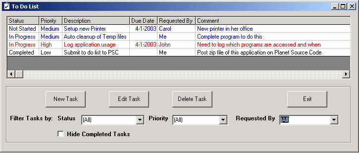



## To Do List

### Description

This is a simple program to manage a "To Do List" of tasks. I needed a program to manage multiple projects and tasks that I'm working on, not necessarily all in Visual Basic, so I wrote this application. The program allows for a Task Description, Comment, Due Date, Priority, Requested By And Status to be entered and stored. The display can be sorted by any column and can also be filtered by Status, Priority and Requested By.

The user Interface is based on the MZ-Tools VB Add-In (www.mztools.com) which didn't meet my needs for this specific case, although otherwise it is an awesome download.
 
### More Info
 

             |
---                |---
**Submitted On**   |2003-02-25 13:38:12
**By**             |[Robin Dyer](https://github.com/Planet-Source-Code/PSCIndex/blob/master/ByAuthor/robin-dyer.md)
**Level**          |Advanced
**User Rating**    |4.0 (16 globes from 4 users)
**Compatibility**  |VB 6\.0
**Category**       |[Complete Applications](https://github.com/Planet-Source-Code/PSCIndex/blob/master/ByCategory/complete-applications__1-27.md)
**World**          |[Visual Basic](https://github.com/Planet-Source-Code/PSCIndex/blob/master/ByWorld/visual-basic.md)
**Archive File**   |[To\_Do\_List155372332003\.zip](https://github.com/Planet-Source-Code/robin-dyer-to-do-list__1-43705/archive/master.zip)

